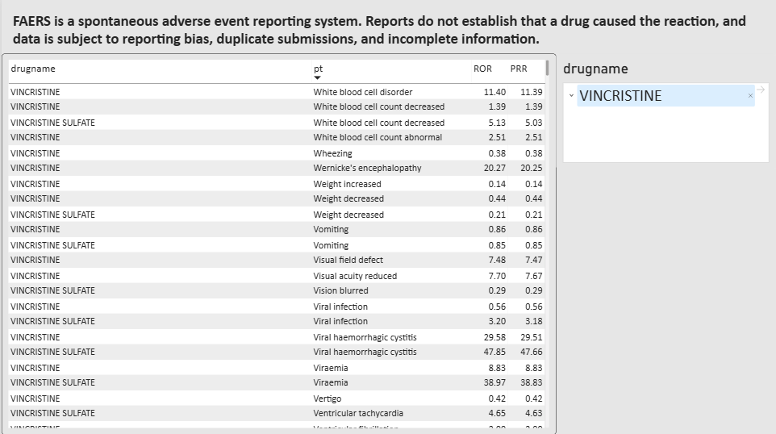
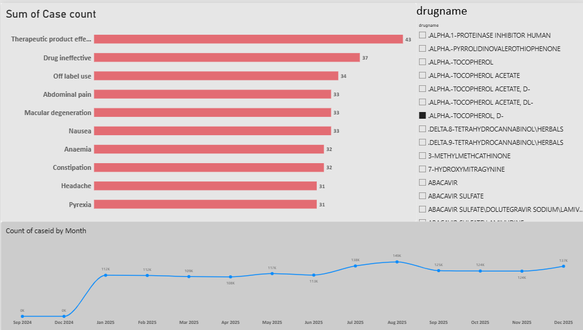
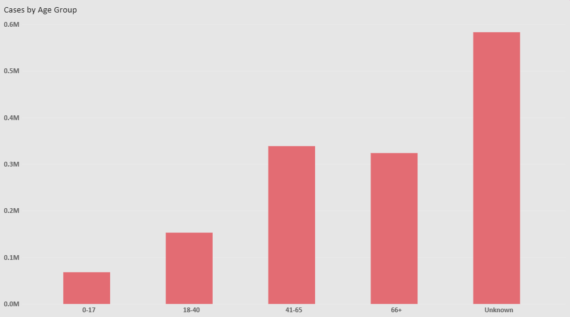
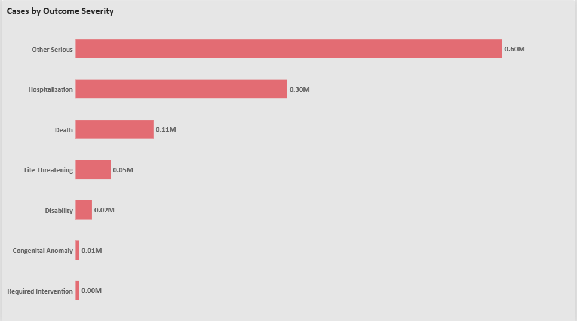

# FAERS Adverse Event Signal Detection Dashboard

An end-to-end pharmacovigilance analytics project: loading raw FDA FAERS
data into SQL Server, cleaning and deduplicating it, calculating drug
safety signal scores (PRR/ROR), and visualizing the results in an
interactive Power BI dashboard.

---

## Overview

The FDA's FAERS (FDA Adverse Event Reporting System) publishes quarterly,
raw spontaneous adverse event reports submitted by manufacturers,
healthcare providers, and consumers. This project takes four quarters of
2025 FAERS data (~1.6M raw case records) and turns it into a clean,
statistically validated, interactive safety-signal dashboard.

**What this project demonstrates:**
- Loading and reconciling a genuinely messy, multi-file government data format
- SQL-based ETL: deduplication, unit conversion, outlier handling
- Applying an established pharmacovigilance statistical method (PRR/ROR
  disproportionality analysis) with the corrections real analysts use to
  keep it statistically reliable
- Building a multi-page, interactive Power BI dashboard on top of it

---

## Tech Stack

- **SQL Server** — data loading, cleaning, deduplication, signal calculation
- **Power BI** — interactive dashboard (drug search, drill-downs, trend analysis)
- **Source data** — [FDA FAERS Quarterly Data Files](https://fis.fda.gov/extensions/FPD-QDE-FAERS/FPD-QDE-FAERS.html) (ASCII format, 2025 Q1–Q4)

---

## Repository Structure

```
faers-adverse-event-dashboard/
├── README.md
├── sql/
│   └── faers_pipeline.sql        # full pipeline: schema, load, dedup, signal calc
├── powerbi/
│   └── FAERS_Dashboard.pbix      # Power BI file (optional — see note below)
└── screenshots/
    ├── 01_signal_overview.png
    ├── 02_drug_deep_dive.png
    ├── 03_age_and_trend.png
    └── 04_outcome_severity.png
```

**Note on the `.pbix` file:** including it is optional. It lets anyone
with Power BI Desktop open and interact with the dashboard themselves,
but it can be large and doesn't diff/version well in Git. Screenshots in
the README are what most people actually see when browsing the repo, so
they matter more than the `.pbix` itself.

---

## Methodology

### 1. Data Loading
FAERS ships as 7 separate `$`-delimited ASCII files per quarter (DEMO,
DRUG, REAC, OUTC, THER, INDI, RPSR), linked by `primaryid`. Files were
loaded into staging tables shaped exactly like the source files, then
pushed into tagged final tables — see `sql/faers_pipeline.sql` for the
full loop-based load logic across all 4 quarters.

### 2. Deduplication
FAERS reissues a case under a new `caseversion` whenever it's corrected
or updated, rather than overwriting the original. Only the latest
version of each case is kept (with a tiebreaker for the rare cases where
two rows share the same max version), reducing ~1.6M raw rows to
**1,466,941 unique cases**.

### 3. Data Cleaning
- Converted FAERS' text-based dates into real `DATE` columns
- Normalized `age` (which FAERS stores in mixed units — years, months,
  weeks, days, hours) into a single `age_years` value, capping a small
  number of clearly invalid entries (e.g. one recorded age of 962)
- Bucketed ages into readable groups (0–17, 18–40, 41–65, 66+, Unknown)

### 4. Signal Detection (PRR / ROR)
For every drug–reaction pair, calculated:
- **PRR** (Proportional Reporting Ratio)
- **ROR** (Reporting Odds Ratio)

with a **Haldane-Anscombe continuity correction** (standard in
pharmacovigilance) to handle zero-count cells, followed by three
reliability filters to remove statistically unstable pairs caused by
low drug volume, low reaction volume, or a near-zero comparison group.
**562,737 validated drug-reaction pairs** remain after filtering.

### 5. Dashboard
Built in Power BI across 4 pages:
- **Signal Overview** — sortable/searchable table of all validated
  drug–reaction pairs with PRR/ROR, plus a data-limitations disclosure
- **Drug Deep-Dive** — drug picker with top-10 reactions by case count
- **Cases by Age Group** — age distribution and reporting trend over time
- **Outcome Severity** — case counts by clinical outcome (Death,
  Hospitalization, Life-Threatening, etc.)

---

## Key Data-Quality Decisions

A few notable issues in the raw data that this pipeline explicitly
addresses (details are commented directly in `faers_pipeline.sql`):

- FAERS' `BULK INSERT` requires the staging table's column count to
  match the file exactly — a mismatch silently corrupts the last columns
- The `DRUG` file uses CRLF line endings; the other six files use LF only
- A small percentage of rows contain embedded delimiter characters inside
  free-text fields, requiring a tolerant error threshold rather than
  hand-fixing each row
- Raw PRR/ROR values can be wildly inflated (into the millions) for three
  distinct statistical reasons, each requiring its own filter — not just
  a single "minimum count" rule

---

## Screenshots

### Signal Overview


### Drug Deep-Dive


### Cases by Age Group & Reporting Trend


### Outcome Severity


---

## Limitations

FAERS is a spontaneous reporting system. Reports do not establish that a
drug caused a reported reaction, and the data is subject to reporting
bias, duplicate submissions, and incomplete information. PRR/ROR values
indicate statistical disproportionality, not confirmed causal safety
signals — this is standard practice and caveat in real pharmacovigilance
work, not a limitation unique to this project.

---

## Data Source

FDA FAERS Quarterly Data Files (ASCII), 2025 Q1–Q4:
https://fis.fda.gov/extensions/FPD-QDE-FAERS/FPD-QDE-FAERS.html
